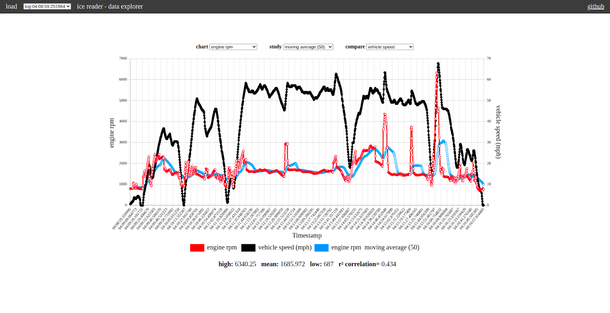

# car-diagnostics
Raspberry Pi Zero W [OBD-II](https://en.wikipedia.org/wiki/On-board_diagnostics) webapp, demo online at [https://ice-reader.herokuapp.com](https://ice-reader.herokuapp.com).

## Hardware
[Raspberry Pi Zero W](https://www.adafruit.com/product/3708)

[Adafruit OLED Display Pack](https://www.adafruit.com/product/3192)

[OBD-II Cable](https://www.amazon.com/ScanTool-OBDLink-USB-Professional-Diagnostics/dp/B005ZWM0R4)

[USB to USB Micro](https://www.adafruit.com/product/2910)

[Pi Zero Case](https://www.adafruit.com/product/3252)

[Micro SD Card (4GB+)](https://www.amazon.com/Micro-Center-Class-Memory-Adapter/dp/B07YLYX4NL/)

## Installation
[Download the pre-built image here]()

[Flash the image to SD card](https://www.raspberrypi.org/documentation/installation/installing-images/)

## Usage
1) Fit Pi into case

2) Attach display board to headers

3) Mount in car [recommended](https://www.homedepot.com/p/3M-Scotch-1-in-x-1-in-Black-Extreme-Fasteners-6-Sets-Pack-RFD7021/206180486)

4) Supply power to 'PWR IN' port

5) Connect OBD-II cable + micro adapter to 'USB' port

6) Use joystick and buttons to navigate

7) Connect to WiFi network 'pi' with password 'raspberry' on any device

8) Visit '192.168.1.1:8080' in browser for webapp

### License - MIT
